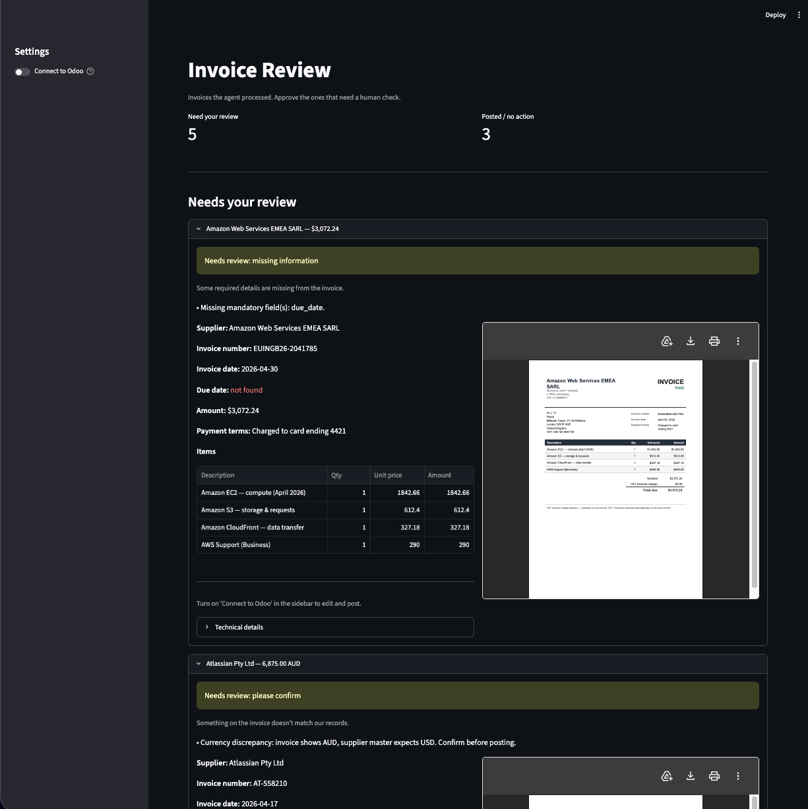

# Automated Odoo Invoicing Agent

A background service that watches an inbox for vendor-invoice PDFs, extracts the fields with
an LLM, validates them against finance rules, and writes a **Vendor Bill** (`account.move`)
to Odoo — **auto-posting clean invoices from approved vendors** and **flagging everything else
for a human** (missing fields, unknown vendor, duplicate, low confidence). Every action is
written to Odoo's chatter as an audit trail.

## Design philosophy

Exactly **one** step is genuinely "AI" — reading messy PDFs into structured fields. Everything
else (validation, supplier matching, duplicate detection, the Odoo writes) is **deterministic
code**: testable, predictable, auditable. The LLM hands the validator typed data; the
validator alone decides post vs flag. Nothing doubtful is ever auto-posted.

## How it works

```
inbox (folder)  ->  pdf filter  ->  EXTRACT (LLM, the only AI step)
   ->  match vendor (LLM)  ->  validate (deterministic)  ->  decide
   ->  AUTO_POST  ─────────►  Odoo: create account.move + action_post
   └─  FLAG_*     ─────────►  Odoo: create DRAFT + mail.activity + chatter note
   ->  audit (message_post on every event)
```

Pipeline stages (`app/`):

| Stage | File | What it does |
|---|---|---|
| Inbox | `inbox.py` | `FolderInbox` (demo) or `GmailInbox` (real, IMAP) behind one `InboxSource` Protocol; PDF-only filter |
| Extract | `extract.py` | `pymupdf4llm` text (Tesseract OCR for scans) → PydanticAI agent → typed `InvoiceData`; LLM-vision fallback; confidence ladder; file-hash cache |
| Rules | `rules.py` | LLM supplier match + deterministic validation (complete? duplicate? approved? currency?) → a `Decision` |
| Odoo | `odoo.py` | Interface + stub + XML-RPC client; create/post, draft+activity, chatter audit |
| Orchestrate | `pipeline.py` | The deterministic spine + atomic dedup store + retry + run log; one unit of work per file |
| Run | `run.py` | Concurrent runner, dead-letter, run log |
| ADK | `agent.py` | Google ADK agent that orchestrates the pipeline as tools |

## Two ways to run, one core

Both share the identical deterministic pipeline:

- **`app/run.py`** — the core engine. Concurrent, with retries + a dead-letter for failures.
- **`app/agent.py`** — the same pipeline wrapped as a **Google ADK** `LlmAgent` whose tools are
  the stages. The agent orchestrates; it never makes the post/flag decision.

This is a deliberate two-layer design — **ADK for orchestration, PydanticAI for typed LLM I/O** —
each used for its strength, not redundancy.

## Quickstart

> **Data & privacy.** Anything derived from the provided materials is kept out of this repo to
> protect the company's data:
> - `data/` — the sample invoice PDFs and the Approved Supplier List
> - `inputs/` — the brief and original materials
> - `eval/golden_set.json` — the hand-labelled expected field values (i.e. the invoice contents)
>
> These are `.gitignore`d; the reviewer already has the originals. To run locally, place the
> sample PDFs in `data/inbox/`, the supplier list at `data/approved_suppliers.xlsx`, and (for
> the eval) recreate `eval/golden_set.json` from the invoices.

```bash
# 1. Install (uv)
uv sync --extra adk

# 2. Configure secrets
cp .env.example .env        # then set OPENAI_API_KEY=...

# 3. Bring up Odoo + provision the DB + Accounting
docker compose up -d
uv run python scripts/odoo_setup.py
uv run python scripts/odoo_check.py     # confirms XML-RPC login

# 4a. Run the core pipeline against real Odoo
uv run python -m app.run --real
#   add --gmail to ingest from a real Gmail inbox over IMAP (needs GMAIL_* in .env)

# 4b. Or run a single invoice through the ADK agent
uv run python -m app.agent data/inbox/03_Atlassian.pdf

# Reset Odoo bills between demo runs
uv run python scripts/odoo_reset.py

# 5. Review dashboard (reads the latest run; live Approve & Post back to Odoo)
uv sync --extra dashboard
uv run streamlit run dashboard/review_app.py
```

Without `--real`, `app.run` uses a stub Odoo client that records the calls it would make — so
the whole flow runs with no Odoo at all.

## What the 8 sample invoices do

The sample set is engineered so each PDF exercises a distinct path:

| Invoice | Decision | Why |
|---|---|---|
| GoogleCloud, Atlassian, Communere | AUTO_POST | complete + approved vendor |
| AWS, Sentry | FLAG_INCOMPLETE | no due date (card charge / paid receipt) |
| GitHub | FLAG_INCOMPLETE | missing invoice number |
| Northwind | FLAG_NEW_VENDOR | not on the Approved Supplier List → SE review |
| Atlassian (resend) | FLAG_DUPLICATE | same invoice number as Atlassian; no second bill created |

## Real vs stubbed

- **Real:** PDF extraction (born-digital text + Tesseract OCR for scans + LLM-vision fallback),
  LLM supplier matching, validation engine, atomic duplicate detection, live Odoo bill
  create/post + draft+flag+activity + chatter audit, ADK agent, concurrency + retries +
  dead-letter, Gmail/IMAP inbox.
- **Default demo path:** the folder inbox (so it runs with no extra config); `--gmail` switches
  to the real Gmail/IMAP inbox.
- **Documented, not built:** Cloud Run deployment, secrets manager, queue at scale.

## Validation rules (verbatim from the brief)

An invoice auto-posts only when **all seven fields are present AND the vendor is approved**.
Precedence: `duplicate → low-confidence → incomplete → unapproved → AUTO_POST`. We deliberately
do not invent exceptions (e.g. the missing due dates on AWS/Sentry flag for a human rather than
auto-post). See `docs/DECISIONS.md`.

## Tests

```bash
uv run pytest
```

32 tests. The LLM-dependent tests (live extraction, ADK agent) skip automatically without an
`OPENAI_API_KEY`; everything else (validation, supplier mapping, the atomic-claim race, retry,
pipeline routing) runs deterministically with no tokens.

## Docs

- `docs/DECISIONS.md` — architecture, the full sample decision matrix, judgment calls, scalability.
- `RUNBOOK.md` — operate, triage, rollback, ownership.

## Review dashboard

`uv run streamlit run dashboard/review_app.py` shows every processed invoice — decision,
reasons, all extracted fields, a PDF preview, and the Odoo move id. Flagged invoices get a
live **Approve & Post** button (posts the draft in Odoo) and an audit-trail (chatter) view.
This is the human-in-the-loop surface where Finance actions what the agent escalated.



## What I'd do next

- "Add vendor to approved list → reprocess" action in the dashboard (currently Approve & Post).
- Cloud Run deploy: queue-in → autoscaled stateless workers → Postgres dedup store.
